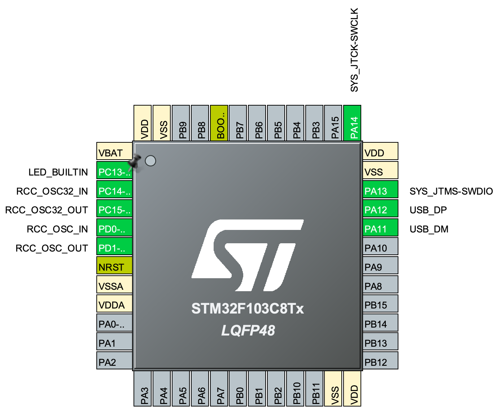

# BluePill Template
This is a template STM32 CubeMX/CubeIDE project for an STM32 "bluepill" board. It sets up the clocks to use the external crystals, GPIO for the onboard LED, and the USB port as a serial port.   

### Configured Pins

### Configured Clock Tree

